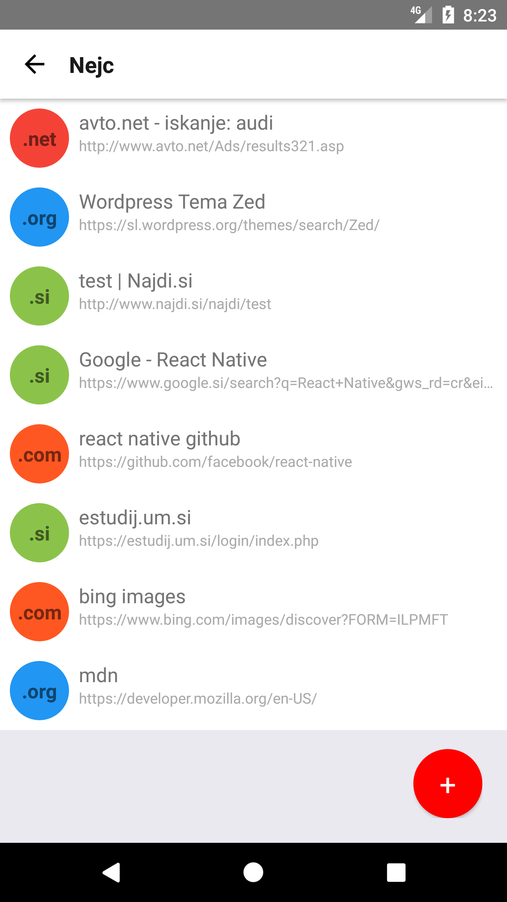
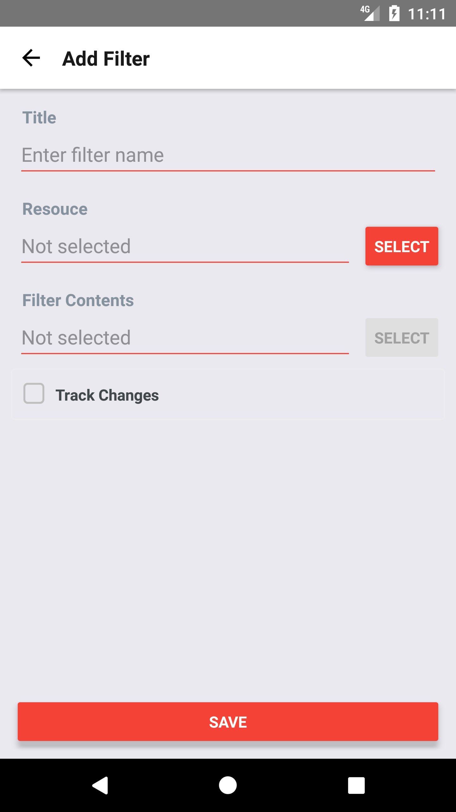
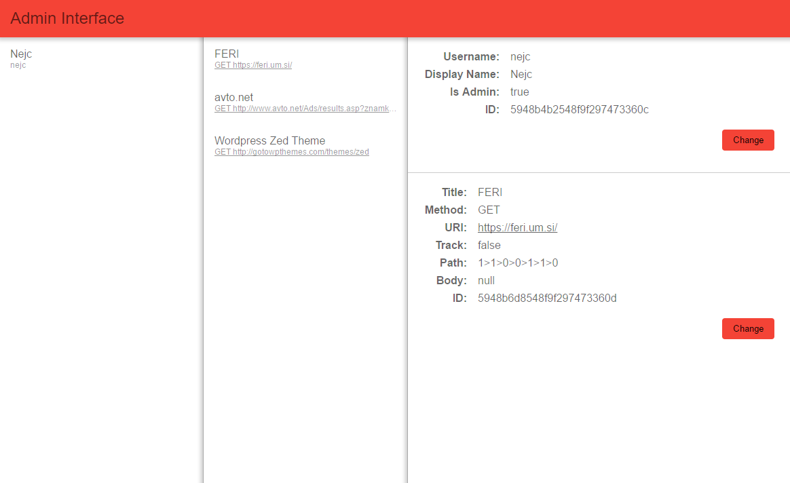

This project was a coursework projected developed at University of Maribor in academic year 2017/2018 for study purposes. This is not a final product but a study project.

# React Native Tracker

This projected features a React Native app where you can specify a specific part of a website to track. After registering your selection, the backend continuously checks the website for changes and updates the client app when such a change occurs. A handy administration panel allows one to oversee users and their tracked items.

## Project Structure

- `admin` features an admin panel built with Angular
- `client` features the client React Native app
- `server` contains the RESTful backend part of the service with Node.JS and MongoDB
- `_legacy` contains initial and now outdated/legacy proposal for the project

## Disclaimer

This projected features a React Native app where you can specify a specific part of a website to track. After registering your selection, the backend continuously checks the website for changes and updates the client app when such a change occurs. A handy administration panel allows one to oversee users and their tracked items.

	

		
		
		
		
	

